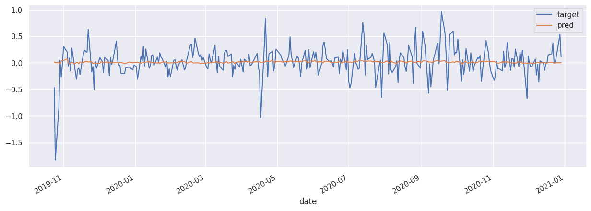
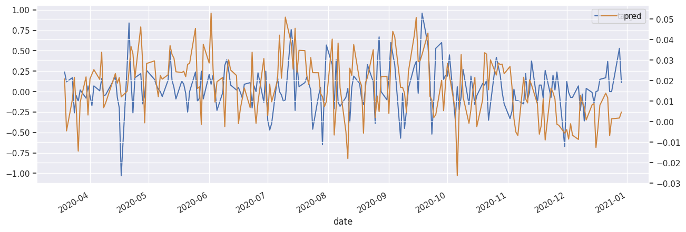

I noticed that some of the columns were useless (std=0)

I plotted cumsum of returns and noticed spikes over various events such as early 2018.

I noticed that some columns are binary. Some have clear seasonality. I messed around with seasonal decomposition, decided to ignore this.

I noticed that some columns seem to represent prices (non stationary) 
Some seem to represent returns (pass the ADF test)
I noticed that columns sometimes come in consecutive pairs, (price, returns)  eg. (41, 42) (5,6) ...

To address this, I added returns (diff) for each column and used both types of data in the model. 

With the objective of reducing the number of original features, I added lags and started fitting various models.
I fit various regularised linear models (Lasso, Ridge), I fit random forest models, using CVsearch, I fit XGBoost and gradient boosting models. I varied the number of lags. And I performed forward stepwise subset selection.
Some models performed better than a naive model (mean of y_cv). 
I noted the columns that regularly appeared in the top models, using feature_importances_ and coef_ attributes and by observing stepwise selection.

significant columns:
[0, 4, 5, 6, 9, 36, 39, 40, 41, 42, 44, 45, 72, 74, 78, 85, 86, 89]
best max lag: 5


```python
import numpy as np
import pandas as pd
import matplotlib.pyplot as plt
from sklearn.model_selection import KFold

# from my exploration I found some columns that have a lot more predictive power than others
significant_columns = [0, 4, 5, 6, 9, 36, 39, 40, 41, 42, 44, 45, 72, 74, 78, 85, 86, 89]

# also from my exploration I settled on a max lag of 5
max_lag = 5

# read
df = pd.read_excel('data_for_mle_test.xlsx')
```


```python
# some setup

# set seaborn if available
try:
    import seaborn as sns
    sns.set()
except:
    pass

# rename first col to date
df.rename(columns={df.columns[0]: 'date'}, inplace=True)

# target is the value of the next day
df['target'] = df[0].shift(-1)

# rename columns like this: ~0~
for col in df.columns:
    if col != 'date' and col != 'target':
        new_name = f'~{col}~'
        df.rename(columns={col: new_name}, inplace=True)

significant_columns = [f'~{col}~' for col in significant_columns]

print(f'shape: {df.shape}')
```

    shape: (1517, 101)


```python
# Plot cumsum of target returns. Also 41, 42 to demonstrate they are related.

fig, ax1 = plt.subplots(figsize=(10,5))

# Plot the first column on the left y-axis
ax1.plot(df['date'], df['~41~'], label='~41~', alpha=0.8)
ax1.plot(df['date'], df['~42~'], label='~42~', alpha=0.8)
ax1.legend(loc='upper left')

# Create a second y-axis on the right side of the plot
ax2 = ax1.twinx()
ax2.plot(df['date'], df['~0~'].cumsum(), color='black', label='Price', alpha=1)
ax2.legend(loc='upper right')
ax2.grid(False)

# Set the titles and axis labels
ax1.set_ylabel('Values')
ax2.set_ylabel('Price')
ax1.set_xlabel('Date')

plt.show()

argmax = df['~42~'].argmax()
print(df['date'][argmax])

```


    

    


    2018-03-01 00:00:00


In February 2018, the global market experienced a sharp increase in demand for lithium, primarily driven by the booming electric vehicle (EV) industry. This sudden surge in demand led to a significant strain on lithium supplies, as the production capabilities were not able to keep up with the rapidly growing needs. Consequently, the prices of lithium soared, reaching their highest levels in a decade.

Additionally, there were growing concerns about the stability of the global lithium supply. A major lithium mining site, which was a significant contributor to the world's lithium supply, underwent an unexpected shutdown due to maintenance and environmental concerns. This closure further exacerbated the supply constraints, contributing to the steep rise in lithium prices during this period. The situation highlighted the challenges in the lithium market, particularly regarding the reliance on a limited number of mining sites for this critical component in EV manufacturing.


```python

```

In the dataset, some columns represent prices, while others represent returns. To address this, I suggest adding returns (diff) for each column and utilize both types of data in the model, incorporating both the original (non-diff) and the differential data.

Consider aggregating the returns columns, for example, those between [5-10], by taking the cumulative sum of returns and calculating the differences. However, it seems more efficient to keep the approach straightforward and use every lag up to a maximum of 5, in a sequence like [0, 1, 3, 3, 4, 5]. This means retaining every lag without aggregating them. This approach is logical, especially considering that recent days are often the most important in such analyses.


```python
# add lags and drop na 

# suppress warnings
try:
    import warnings 
    warnings.filterwarnings("ignore", category=pd.errors.PerformanceWarning)
except:
    pass

# add difference and shift features
for col in significant_columns:
    df[f'_nondiff_{col}'] = df[col]
    df[f'_diff_{col}'] = df[col].diff()

# create lag features
for col in [col for col in df.columns if 'diff' in col]:
   for lag in range(0, max_lag+1):
       df[f'lag{lag}_{col}'] = df[col].shift(lag)

lag_cols = [col for col in df.columns if 'lag' in col]

# drop na
print(f'before dropna: {df.shape}')
df.dropna(inplace=True)
print(f'after dropna: {df.shape}')

df.reset_index(drop=True, inplace=True)

print(f'\nlags: {lag_cols[:3]}..')
print(f'...{lag_cols[-3:]}')
print(f'\nlen: {len(lag_cols)}')
```

    before dropna: (1517, 353)
    after dropna: (1510, 353)
    
    lags: ['lag0__nondiff_~0~', 'lag1__nondiff_~0~', 'lag2__nondiff_~0~']..
    ...['lag3__diff_~89~', 'lag4__diff_~89~', 'lag5__diff_~89~']
    
    len: 216


```python
# displaying a subset to see the structure of the dataframe

display_cols = ['~42~', 'lag0__nondiff_~42~', 'lag1__nondiff_~42~', 'lag2__nondiff_~42~', 'lag0__diff_~42~', 'lag1__diff_~42~', 'lag2__diff_~42~', 'date', 'target']
df[display_cols].head(4)

# this is how it looks now:
```


<div>
<style scoped>
    .dataframe tbody tr th:only-of-type {
        vertical-align: middle;
    }

    .dataframe tbody tr th {
        vertical-align: top;
    }

    .dataframe thead th {
        text-align: right;
    }
</style>
<table border="1" class="dataframe">
  <thead>
    <tr style="text-align: right;">
      <th></th>
      <th>~42~</th>
      <th>lag0__nondiff_~42~</th>
      <th>lag1__nondiff_~42~</th>
      <th>lag2__nondiff_~42~</th>
      <th>lag0__diff_~42~</th>
      <th>lag1__diff_~42~</th>
      <th>lag2__diff_~42~</th>
      <th>date</th>
      <th>target</th>
    </tr>
  </thead>
  <tbody>
    <tr>
      <th>0</th>
      <td>0.10</td>
      <td>0.10</td>
      <td>0.20</td>
      <td>0.00</td>
      <td>-0.10</td>
      <td>0.20</td>
      <td>-0.40</td>
      <td>2015-01-26</td>
      <td>-0.03</td>
    </tr>
    <tr>
      <th>1</th>
      <td>0.25</td>
      <td>0.25</td>
      <td>0.10</td>
      <td>0.20</td>
      <td>0.15</td>
      <td>-0.10</td>
      <td>0.20</td>
      <td>2015-01-27</td>
      <td>0.13</td>
    </tr>
    <tr>
      <th>2</th>
      <td>0.65</td>
      <td>0.65</td>
      <td>0.25</td>
      <td>0.10</td>
      <td>0.40</td>
      <td>0.15</td>
      <td>-0.10</td>
      <td>2015-01-28</td>
      <td>0.25</td>
    </tr>
    <tr>
      <th>3</th>
      <td>0.20</td>
      <td>0.20</td>
      <td>0.65</td>
      <td>0.25</td>
      <td>-0.45</td>
      <td>0.40</td>
      <td>0.15</td>
      <td>2015-01-29</td>
      <td>-0.23</td>
    </tr>
  </tbody>
</table>
</div>


```python
# You can see that 
# lag0__nondiff_~42~ == ~42~
# lag__diff_~42~ is the returns of ~42~ since yesterday 
# etc for lags up to 5

# so now we can use any columns with 'lag' (lag_cols) to predict the target 
```


```python

```


```python
# create a test set for out of sample backtesting later
from sklearn.model_selection import train_test_split
df_train, df_test = train_test_split(df, test_size=0.2, shuffle=False)
import numpy as np
from sklearn.linear_model import Ridge
from sklearn.metrics import mean_squared_error
from sklearn.preprocessing import StandardScaler
from sklearn.model_selection import KFold
```


```python
# Calculate best ridge regression, using only training data 
# I will display naive errors as a reference (ie predicting the mean)

dfX = df_train[lag_cols]
X = dfX.values
y = df_train['target'].values

# little exploration lead to this range
alphas = np.logspace(4, 5, 100)

kf = KFold(n_splits=5, shuffle=False)

alpha_test_errors = []
alpha_train_errors = []
printed_naive_error = False
for i, alpha in enumerate(alphas):
    test_errors = []
    train_errors = []
    naive_test_errors = []
    naive_train_errors = []
    null_errors = []
    for train_index, test_index in kf.split(X):
        X_train, X_test = X[train_index], X[test_index]
        y_train, y_test = y[train_index], y[test_index] 
        # scale
        scale = StandardScaler()
        X_train = scale.fit_transform(X_train)
        X_test = scale.transform(X_test)
        # fit
        model = Ridge(alpha=alpha)
        model.fit(X_train, y_train)
        # predict
        y_pred = model.predict(X_test)
        y_pred_train = model.predict(X_train)
        # score
        test_error = mean_squared_error(y_test, y_pred)
        train_error = mean_squared_error(y_train, y_pred_train)
        # append
        test_errors.append(test_error)
        train_errors.append(train_error)

        # for naive test use the mean of the test y, need to use full_like
        naive_test_error = mean_squared_error(y_test, np.full_like(y_test, np.mean(y_test)))
        naive_train_error = mean_squared_error(y_test, np.full_like(y_test, np.mean(y_train)))
        # for null error use 0
        null_error = mean_squared_error(y_test, np.zeros_like(y_test))

        naive_test_errors.append(naive_test_error)
        naive_train_errors.append(naive_train_error)
        null_errors.append(null_error)


    alpha_test_errors.append(np.mean(test_errors))
    alpha_train_errors.append(np.mean(train_errors))

    # print naive error only once
    if not printed_naive_error:
        print(f'naive test error: {np.mean(naive_test_errors)}')
        print(f'      null error: {np.mean(null_errors)}\n')
        printed_naive_error = True

    # print other errors
    # print(f'alpha: {alpha}')
    if i % 10 == 0:
        print(f'      test error: {np.mean(test_errors)}, alpha: {alpha}')

```

    naive test error: 0.11314065193864213
          null error: 0.11329905215870509
    
          test error: 0.11331685795500337, alpha: 10000.0
          test error: 0.11296363528999509, alpha: 12618.56883066021
          test error: 0.11271993418605193, alpha: 15922.82793341094
          test error: 0.11257056270902226, alpha: 20092.33002565046
          test error: 0.11249895926245324, alpha: 25353.644939701113
          test error: 0.11248807142229815, alpha: 31992.671377973846
          test error: 0.11252146389884762, alpha: 40370.17258596558
          test error: 0.11258433140248529, alpha: 50941.38014816386
          test error: 0.1126642093742706, alpha: 64280.73117284319
          test error: 0.11275130679867154, alpha: 81113.08307896872


```python
print(f'best test error: ', np.min(alpha_test_errors))
print(f'best alpha: ', alphas[np.argmin(alpha_test_errors)])

```

    best test error:  0.11248596398508748
    best alpha:  29836.472402833402


```python
# plot 
import matplotlib.pyplot as plt
plt.plot(alphas, alpha_test_errors, label='test')
plt.plot(alphas, alpha_train_errors, label='train')
plt.xscale('log')
plt.xlabel('alpha')
plt.ylabel('error')
plt.legend()
plt.show()

```


    

    


```python
# plot 
import matplotlib.pyplot as plt
plt.plot(alphas, alpha_test_errors, label='test')
plt.ylim(0.1122, 0.113)
plt.xscale('log')
plt.xlabel('alpha')
plt.ylabel('error')

plt.legend()
plt.show()

```


    

    


```python
best_alpha = alphas[np.argmin(alpha_test_errors)]
print(f'best alpha: {best_alpha}')
```

    best alpha: 29836.472402833402


```python
# fit the model and scaler over the whole training set

X_train = df_train[lag_cols].values
y_train = df_train['target'].values
X_test = df_test[lag_cols].values
y_test = df_test['target'].values

# scale
scale = StandardScaler()
X_train = scale.fit_transform(X_train)
X_test = scale.transform(X_test)

# fit
model = Ridge(alpha=best_alpha)
model.fit(X_train, y_train)

# predict on test set
y_pred = model.predict(X_test)

# score
test_error = mean_squared_error(y_test, y_pred)
print(f'test error: {test_error}')
```

    test error: 0.07188606020881336


I use the sharpe ratio as the final metric
If the sharpe ratio is higher, this allows you to take more risk: using higher leverage
Theoretically you should achieve higher returns than the more volatile strategies, even if they have higher apparent returns


```python
# checking shapes line up
print(f'y_pred shape: {y_pred.shape}')
print(f'df_test shape: {df_test.shape}')
```

    y_pred shape: (302,)
    df_test shape: (302, 353)


```python
# here i add the predictions to the test set, setting up the backtest
df_test['pred'] = y_pred
# get just target, date, pred and ~0~ 
df_test = df_test[['date', 'target', 'pred', '~0~']]
df_test.tail(10)
```


<div>
<style scoped>
    .dataframe tbody tr th:only-of-type {
        vertical-align: middle;
    }

    .dataframe tbody tr th {
        vertical-align: top;
    }

    .dataframe thead th {
        text-align: right;
    }
</style>
<table border="1" class="dataframe">
  <thead>
    <tr style="text-align: right;">
      <th></th>
      <th>date</th>
      <th>target</th>
      <th>pred</th>
      <th>~0~</th>
    </tr>
  </thead>
  <tbody>
    <tr>
      <th>1500</th>
      <td>2020-12-15</td>
      <td>-0.14</td>
      <td>0.008806</td>
      <td>-0.01</td>
    </tr>
    <tr>
      <th>1501</th>
      <td>2020-12-16</td>
      <td>0.00</td>
      <td>-0.012574</td>
      <td>-0.14</td>
    </tr>
    <tr>
      <th>1502</th>
      <td>2020-12-17</td>
      <td>0.01</td>
      <td>-0.003185</td>
      <td>0.00</td>
    </tr>
    <tr>
      <th>1503</th>
      <td>2020-12-18</td>
      <td>0.15</td>
      <td>0.008020</td>
      <td>0.01</td>
    </tr>
    <tr>
      <th>1504</th>
      <td>2020-12-21</td>
      <td>0.17</td>
      <td>0.013886</td>
      <td>0.15</td>
    </tr>
    <tr>
      <th>1505</th>
      <td>2020-12-22</td>
      <td>0.37</td>
      <td>0.011640</td>
      <td>0.17</td>
    </tr>
    <tr>
      <th>1506</th>
      <td>2020-12-23</td>
      <td>0.00</td>
      <td>-0.006808</td>
      <td>0.37</td>
    </tr>
    <tr>
      <th>1507</th>
      <td>2020-12-24</td>
      <td>0.00</td>
      <td>0.001394</td>
      <td>0.00</td>
    </tr>
    <tr>
      <th>1508</th>
      <td>2020-12-28</td>
      <td>0.53</td>
      <td>0.001776</td>
      <td>0.00</td>
    </tr>
    <tr>
      <th>1509</th>
      <td>2020-12-29</td>
      <td>0.11</td>
      <td>0.004671</td>
      <td>0.53</td>
    </tr>
  </tbody>
</table>
</div>


```python
# plot predictions 
df = df_test
df.plot(x='date', y=['target', 'pred'], figsize=(15, 5))
```


    <Axes: xlabel='date'>


    

    


```python

```


```python
# plot using twinx, this uses different y axis
ax1 = df[-200:].plot(x='date', y='target', figsize=(15, 5))
df[-200:].plot(x='date', y='pred', ax=ax1.twinx(), color='peru')
```


    <Axes: xlabel='date'>


    

    


```python
# observing the scale difference between prediction and target, so I can display them better
print(f'ratio: {df["target"].std() / df["pred"].std()}')
```

    ratio: 17.793306315228833


```python
# lets scale the prediction by 10 and have a look
df['pred_10x'] = df['pred'] * 10 
df[-150:].plot(x='date', y=['target', 'pred_10x'], figsize=(15, 5))
```


    <Axes: xlabel='date'>


    

    


```python
# Not bad!
```


```python
# First lets observe the price over the test period
# Note: this is not true price as it starts at 0
df['price'] = df['~0~'].cumsum()
df.plot(x='date', y='price', figsize=(15, 5))
```


    <Axes: xlabel='date'>


    

    


```python
# Well, the price is going up. Incidentally this plot represents the same as buying 1.0 every day.

# calculate statistics for the always-buy strategy
mean_daily_return = df['~0~'].mean()
std_daily_return = df['~0~'].std()
sharpe_ratio = (mean_daily_return / std_daily_return) * np.sqrt(252)
print(f'mean daily return: {mean_daily_return:.4f}')
print(f' std daily return: {std_daily_return:.4f}')
# annualised return
print(f'annualised return: {mean_daily_return * 252:.4f}')
print(f'     sharpe ratio: {sharpe_ratio:.4f}')
```

    mean daily return: 0.0290
     std daily return: 0.2719
    annualised return: 7.3180
         sharpe ratio: 1.6957


```python
# Now lets try an all-in strategy
# Position is 1.0 if pred > 0, -1.0 if pred < 0

df['position_all_in'] = ((df['pred'] > 0)*2 - 1)
df['pnl_all_in'] = df['position_all_in'] * df['target'] 
df['total_pnl_all_in'] = df['pnl_all_in'].cumsum()
```


```python
df.head()
```


<div>
<style scoped>
    .dataframe tbody tr th:only-of-type {
        vertical-align: middle;
    }

    .dataframe tbody tr th {
        vertical-align: top;
    }

    .dataframe thead th {
        text-align: right;
    }
</style>
<table border="1" class="dataframe">
  <thead>
    <tr style="text-align: right;">
      <th></th>
      <th>date</th>
      <th>target</th>
      <th>pred</th>
      <th>~0~</th>
      <th>pred_10x</th>
      <th>price</th>
      <th>position_all_in</th>
      <th>pnl_all_in</th>
      <th>total_pnl_all_in</th>
    </tr>
  </thead>
  <tbody>
    <tr>
      <th>1208</th>
      <td>2019-10-24</td>
      <td>-0.46</td>
      <td>0.017028</td>
      <td>0.50</td>
      <td>0.170278</td>
      <td>0.50</td>
      <td>1</td>
      <td>-0.46</td>
      <td>-0.46</td>
    </tr>
    <tr>
      <th>1209</th>
      <td>2019-10-25</td>
      <td>-1.83</td>
      <td>0.005448</td>
      <td>-0.46</td>
      <td>0.054477</td>
      <td>0.04</td>
      <td>1</td>
      <td>-1.83</td>
      <td>-2.29</td>
    </tr>
    <tr>
      <th>1210</th>
      <td>2019-10-28</td>
      <td>-0.85</td>
      <td>0.000521</td>
      <td>-1.83</td>
      <td>0.005205</td>
      <td>-1.79</td>
      <td>1</td>
      <td>-0.85</td>
      <td>-3.14</td>
    </tr>
    <tr>
      <th>1211</th>
      <td>2019-10-29</td>
      <td>0.05</td>
      <td>-0.015354</td>
      <td>-0.85</td>
      <td>-0.153540</td>
      <td>-2.64</td>
      <td>-1</td>
      <td>-0.05</td>
      <td>-3.19</td>
    </tr>
    <tr>
      <th>1212</th>
      <td>2019-10-30</td>
      <td>-0.26</td>
      <td>0.028193</td>
      <td>0.05</td>
      <td>0.281932</td>
      <td>-2.59</td>
      <td>1</td>
      <td>-0.26</td>
      <td>-3.45</td>
    </tr>
  </tbody>
</table>
</div>


```python
# plot 
df.plot(x='date', y='total_pnl_all_in', figsize=(15, 5))
```


    <Axes: xlabel='date'>


    

    


```python
# calculate statistics for the all-in strategy
mean_daily_return = df['pnl_all_in'].mean()
std_daily_return = df['pnl_all_in'].std()
sharpe_ratio = (mean_daily_return / std_daily_return) * np.sqrt(252)
print(f'mean daily return: {mean_daily_return:.4f}')
print(f' std daily return: {std_daily_return:.4f}')
# annualised return
print(f'annualised return: {mean_daily_return * 252:.4f}')
print(f'     sharpe ratio: {sharpe_ratio:.4f}')
```

    mean daily return: 0.0281
     std daily return: 0.2705
    annualised return: 7.0760
         sharpe ratio: 1.6479


```python
# This is no better. The problem with this strategy is that it is too volatile, betting 1.0 on even the smallest prediction
# To address this, we can scale the position by the prediction.

# print max and min prediction
print(f'max pred: {df["pred"].max()}')
print(f'min pred: {df["pred"].min()}')

```

    max pred: 0.07640822276757199
    min pred: -0.026361762432236858


```python
# scale by 1/max 
df['position_scaled'] = df['pred'] / df['pred'].abs().max()
df['pnl_scaled'] = df['position_scaled'] * df['target']
df['total_pnl_scaled'] = df['pnl_scaled'].cumsum()
# plot
df.plot(x='date', y='total_pnl_scaled', figsize=(15, 5), title='scaled position strategy')
```


    <Axes: title={'center': 'scaled position strategy'}, xlabel='date'>


    

    


```python
# calculate statistics for the scaled strategy
mean_daily_return = df['pnl_scaled'].mean()
std_daily_return = df['pnl_scaled'].std()
sharpe_ratio = (mean_daily_return / std_daily_return) * np.sqrt(252)
print(f'mean daily return: {mean_daily_return:.4f}')
print(f' std daily return: {std_daily_return:.4f}')
# annualised return
print(f'annualised return: {mean_daily_return * 252:.4f}')
print(f'     sharpe ratio: {sharpe_ratio:.4f}')
```

    mean daily return: 0.0147
     std daily return: 0.0722
    annualised return: 3.7004
         sharpe ratio: 3.2274


Nice, 370%. You can see that the scaled strategy almost completely eliminated the early drawdown. 
This strategy is much less volatile.
This high sharpe ratio combined with a properly leveraged account should allow you to achieve higher returns than the simpler strategies.


```python
# Mark some of the buy / sell days 

dfs = df.copy()
dfs = dfs[-100:]
dfs.reset_index(inplace=True, drop=True)
dfs['buy'] = dfs['pred'] > 0
dfs['sell'] = dfs['pred'] < 0
buy_markers = list(dfs[dfs['buy'] == True].index)
sell_markers = list(dfs[dfs['sell'] == True].index)


plt.figure(figsize=(15, 5))
plt.plot(dfs['date'], dfs['price'], marker='x', markevery=sell_markers, markersize=7, markerfacecolor='red', markeredgecolor='red', markeredgewidth=2)
plt.plot(dfs['date'], dfs['price'], marker='x', markevery=buy_markers, markersize=7, markerfacecolor='green', markeredgecolor='green', markeredgewidth=2)
plt.ylabel('price')
plt.show()
```


    

    
